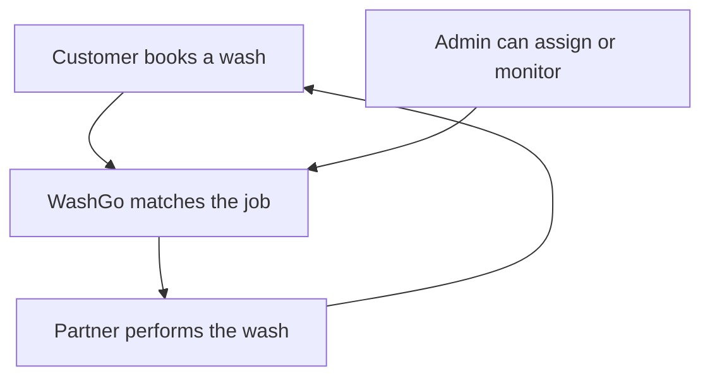

# WashGo — Application Features & Workflows (Non-Technical Guide)

**Last updated:** May 2026  
**Audience:** Business owners, investors, operations teams, and anyone who wants to understand what WashGo does—without technical background.  
**Note:** This guide is based on the current WashGo web application.

---

## Table of contents

1. [What is WashGo?](#1-what-is-washgo)
2. [How the whole system fits together](#2-how-the-whole-system-fits-together)
3. [Customer experience](#3-customer-experience)
4. [Partner (washer) experience](#4-partner-washer-experience)
5. [Admin (operations) experience](#5-admin-operations-experience)
6. [A full story from start to finish](#6-a-full-story-from-start-to-finish)
7. [What is fully working vs preview or demo](#7-what-is-fully-working-vs-preview-or-demo)
8. [Glossary](#8-glossary)

---

## 1. What is WashGo?

**WashGo** is an on-demand car washing service. A customer books a wash at their home, office, or any address they choose. A trained washer (called a **partner** in the app) travels to that location, performs the wash, and updates the job as they go. An **operations team** can watch all activity, assign washers when needed, and review bookings.

### How you use it

WashGo runs as a **website** in your web browser. It works on a laptop, tablet, or phone. There is **no separate mobile app** in the App Store or Google Play today—the same website adapts to smaller screens.

### Three types of users

| User type | Role in simple terms |
|-----------|----------------------|
| **Customer** | Books washes, saves vehicles, tracks the washer, and views history |
| **Partner (washer)** | Signs up to work in the field, accepts jobs, travels to customers, uploads proof photos, and marks jobs complete |
| **Admin** | Oversees the business: sees live bookings, assigns washers, and reviews operational screens |

Each type has its own area of the website. Customers and admins sign in from the main login page. Partners use a dedicated partner login and signup.

---

## 2. How the whole system fits together

At a high level, every wash follows the same path:

**In plain language:**

1. The **customer** submits a booking with vehicle, package, address, and time.
2. The job sits in the system until a **partner accepts** it from their Offers screen, or an **admin assigns** a specific partner.
3. The **partner** travels to the customer, performs the wash, uploads before/after photos, and marks the job complete.
4. The **customer** sees status updates on their dashboard and booking detail page—including a map when the washer is on the way.
5. The **admin** can monitor and intervene at any point (for example, manually assigning a washer if no one has picked up the job).

---

## 3. Customer experience

This section covers everything a car owner can do in WashGo.

### 3.1 Getting started

| Feature | What it does |
|---------|----------------|
| **Landing page** | The public home page. Explains WashGo’s value, shows membership previews, and invites visitors to sign up. |
| **Sign up** | Create an account with full name, email, optional phone number, and password. After signup, you are logged in automatically. |
| **Log in** | Return with email and password. Washer accounts are redirected to the partner area—they cannot use the customer app by mistake. |

### 3.2 Main areas after login

Once logged in, customers see a sidebar with these main sections:

| Section | What it does |
|---------|----------------|
| **Dashboard** | Your home screen. Shows your next wash, quick stats, suggested next steps (add a car, book a wash), an active booking card with timeline, upcoming schedule, saved vehicles, and care tips. |
| **My garage** | Save your vehicles: make, model, year, license plate, and color. Add new cars or remove ones you no longer need. You must have at least one vehicle before booking. |
| **New wash** | A step-by-step booking wizard to schedule a new wash. |
| **Bookings** | A list of all your past and upcoming washes. Tap any booking to open full details. |

### 3.3 Wash packages and pricing

When booking, you choose:

**Wash package (service level)**

| Package | What it includes (in general) |
|---------|------------------------------|
| **Basic** | Exterior rinse and dry |
| **Deluxe** | Exterior plus wheels and trim |
| **Premium** | Fuller detail-ready shine |

**Vehicle size**

| Size | Examples |
|------|----------|
| **Compact** | Smaller cars |
| **Sedan** | Standard cars |
| **SUV / large** | Bigger vehicles |

**How price works**

- The price **updates live** as you change package or size during booking.
- Approximate starting prices before size adjustment: Basic about **$25**, Deluxe about **$40**, Premium about **$60** (larger vehicles cost more).
- The **final price is fixed** when you tap “Confirm booking.”
- Payment checkout inside the app is **not live yet**—see [Section 7](#7-what-is-fully-working-vs-preview-or-demo).

### 3.4 Booking a wash — step by step

The **New wash** wizard has four steps:

**Step 1 — Choose your vehicle**  
Pick one of the cars saved in My garage.

**Step 2 — Package and size**  
Select your wash level and vehicle size. Watch the estimated price update.

**Step 3 — Where and when**  
- Enter your **service address** (where the washer should come).  
- **Pin your exact location** on the map (required so the washer can find you).  
- Pick a **time window**: about 3 hours from now, about 24 hours from now, or about 48 hours from now.

**Step 4 — Review and confirm**  
Check vehicle, package, address, time, and price. Tap **Confirm booking**.

**What happens next**

1. You are taken to the **booking detail** page for that wash.  
2. Status shows **Searching** — the system is looking for a partner to take the job.  
3. When a partner **accepts**, status moves to **Accepted**, then **On the way** as the appointment time gets close.  
4. During the wash you see **In progress**.  
5. When finished you see **Completed**, with optional before/after photos from the partner.

You do **not** pick a specific washer by name when booking—the system matches an available partner, or an admin assigns one.

### 3.5 Tracking your wash

On the **dashboard** and **booking detail** page you can:

- See a **plain-language status** (Searching, Accepted, On the way, etc.).
- Follow a **progress timeline** (finding washer → accepted → on the way → in progress → completed).
- View a **live map** when a washer is assigned and the visit is confirmed or in progress—shows where the washer is and an estimated arrival time when available.
- See **washer details** (name, rating, service area) once someone is assigned.
- View **before and after photos** after the partner uploads them.

The screen refreshes automatically so you do not need to reload the page constantly.

### 3.6 Managing a booking

| Action | When you can do it |
|--------|-------------------|
| **Cancel** | Only while the job is still **Searching** (no washer locked in yet, or still in early pending state). You choose a reason from a list. |
| **Reschedule** | Only while still in that early **pending** stage—change the appointment time. |
| **Contact support** | Once a washer has accepted or work has started, cancel and reschedule are no longer self-serve. The app directs you to contact support (e.g. support@washgo.app) and shows the washer’s name if assigned. |

### 3.7 AI assistant (concierge chat)

A **chat bubble** appears on customer screens (bottom corner). You can ask questions such as:

- How bookings work  
- Pricing and packages  
- What a status means  
- General help with WashGo  

The assistant is powered by an AI service configured on the server (for example, a local AI tool or a cloud AI provider). It helps with information—it does not replace human support for urgent changes to confirmed jobs.

### 3.8 Membership (preview only)

The landing page and dashboard may show **membership plans** (for example, monthly tiers with perks). Today this is **preview content only**:

- Buttons like **“Join waitlist”** show a confirmation message.  
- There is **no live subscription or billing** for customers in the app yet.  
- Backend database tables exist for future membership features, but customers cannot subscribe through the app today.

---

### 3.9 Booking statuses — what customers see

| What you see on screen | What it means |
|------------------------|---------------|
| **Searching** | Your request was submitted. WashGo is looking for a partner to take the job. |
| **Awaiting acceptance** | A partner may be linked; waiting for full confirmation (edge case during matching). |
| **Accepted** | A partner confirmed your job. Your visit is scheduled. |
| **On the way** | Your appointment time is near. The partner should be heading to you. |
| **In progress** | The wash is happening now at your location. |
| **Completed** | The wash is finished. You can view summary and photos. |
| **Cancelled** | The booking was stopped and will not be completed. |

---

## 4. Partner (washer) experience

Partners are the people who perform washes in the field. They use a **separate part of the website** (partner login and signup—not the customer login).

### 4.1 Getting started as a partner

| Feature | What it does |
|---------|----------------|
| **Partner sign up** | Register with name, work email, optional phone and service area, and password. Creates a washer profile linked to your account. |
| **Partner log in** | Sign in with email and password. Only accounts with the washer role can enter the partner app. |
| **Separate session** | Partner login is independent from customer login—you can think of it as a second “app within the website” for field staff. |

Old links that used `/washer/` automatically redirect to `/partner/`.

### 4.2 Partner screens

| Screen | What it does |
|--------|----------------|
| **Dashboard (Home)** | Today’s jobs, active jobs, quick earnings snapshot, and controls to go online or offline. |
| **Offers** | List of **new customer requests** waiting for a partner. You can accept or skip each offer. |
| **Schedule** | Your **upcoming assigned jobs** in one place. |
| **Job detail** | Full workflow for one booking: customer info, map and directions, step-by-step status buttons, photo upload, checklist. |
| **Earnings** | Money earned from **completed** jobs (real totals from the system). Some charts and bonus visuals are illustrative—see Section 7. |
| **Demo job** | Practice the job flow without a real customer—useful for training and demos. |

On mobile, a **bottom navigation bar** shows Home, Offers, Schedule, and Earnings. On desktop, a sidebar is used instead.

### 4.3 Availability — going online for work

Partners control whether they receive new offers:

| Status | Meaning |
|--------|---------|
| **Online** | You are available to work. |
| **Accepting jobs** | You want new offers (combined with online). |
| **Busy** | You do not want new offers right now. |
| **On break** | Paused from new offers. |

When you are **online and accepting jobs**, the system marks you as available for dispatch and lists you for admin assignment. Some preference details are also remembered on your device for a faster experience.

### 4.4 How a partner gets a job — two paths

**Path A — Partner accepts from Offers (marketplace style)**

1. Go **online** and open **Offers**.  
2. Review open customer requests (location, time, package, etc.).  
3. Tap **Accept** on a job you want.  
4. The job is **assigned to you** and appears on your Dashboard and Schedule.  
5. Open the **job detail** page and follow the field workflow (below).

**Path B — Admin assigns you**

1. An operations user assigns you from the **Admin Operations** screen.  
2. The job appears on your **Dashboard** and **Schedule** without you accepting from Offers.  
3. Open the job and follow the same field workflow.

### 4.5 Field workflow — completing a job on site

On the **job detail** page, partners move through steps such as:

1. **Job received / accepted** — confirm you have the assignment.  
2. **On the way** — traveling to the customer (your location can update the customer’s map).  
3. **Arrived** — at the service address.  
4. **Wash started** — work in progress (customer sees “In progress”).  
5. **Upload photos** — **before** and **after** pictures as proof of service (on real jobs, photos are saved to the system).  
6. **Complete** — mark the job finished; the customer sees “Completed.”

A **checklist** on the job page helps partners not miss steps (stored locally on the device for convenience).

**GPS / location:** While you are on the way, your phone can send location updates so customers see you on the map. If location is unavailable, the system may still show a reasonable estimate on the map.

### 4.6 Photo proof

For **real bookings** (not the demo job):

- Upload a **before** photo and an **after** photo from the job page.  
- Customers can view these on their booking detail page after upload.

For the **demo job**, photos use sample images and practice taps—nothing is sent to a real customer.

### 4.7 Earnings

The **Earnings** screen shows:

- **Real data:** totals from jobs you have **completed**, based on booking records in the system.  
- **Illustrative data:** some weekly charts, surge zone highlights, streak bonuses, and tips may be **demo visuals** when the app is showcasing the product—not guaranteed to reflect real payouts yet.

---

## 5. Admin (operations) experience

The **admin console** is for people running WashGo day to day. Access is limited to **admin** accounts (in development, a special demo mode can also open admin screens for presentations—see Section 7).

### 5.1 Admin sections

| Section | What operations can do |
|---------|-------------------------|
| **Overview (command center)** | High-level snapshot: active bookings, fleet activity, KPI-style tiles, live ops bar, charts. Mix of **live booking data** and **sample charts**. |
| **Operations** | **Dispatch hub:** see bookings that still need a washer, view available partners, and **assign** a specific partner to a job. |
| **Bookings** | Searchable table of **all bookings** from the live system. |
| **Users** | Directory tabs for customers, partners, and staff—**sample data for demos**, not a full live CRM yet. |
| **Revenue** | Revenue KPIs and charts—**mostly sample data** for storytelling and investor demos. |
| **Complaints** | Support case queue with SLA-style tiles—**sample data** for demos. |

A notice on admin screens explains which parts sync from **live bookings and fleet** versus which are **sample figures**.

### 5.2 Typical admin workflow — assigning a washer

1. Open **Operations**.  
2. Find a **pending** booking that has **no partner assigned** yet.  
3. Review **available partners** (those marked available in the system).  
4. Select a partner and **assign** them to the booking.  
5. The booking becomes **confirmed** with that partner linked.  
6. Monitor progress on **Overview** or **Bookings** until the job is **completed** or **cancelled**.

Partners then continue the job from their own job detail screen; the customer sees updates automatically.

### 5.3 What admins see in real time

- **Bookings list** and **dispatch queue** refresh from the live system (roughly every few seconds).  
- **Fleet / washer roster** reflects partners who have signed up and their availability.  
- **Counters** for active jobs are derived from real booking statuses where possible.

---

## 6. A full story from start to finish

Here is one example that ties all three roles together.

**Priya (customer)** wants a Deluxe wash for her sedan at her apartment.

1. Priya visits the WashGo website, signs up, and adds her Honda Civic in **My garage**.  
2. She opens **New wash**, picks her Civic, chooses **Deluxe** and **Sedan**, enters her address, pins her building on the map, and selects a time about 24 hours ahead. She confirms at roughly **$46**.  
3. Her booking detail page shows **Searching**.  
4. **Raj (partner)** goes online, opens **Offers**, and **accepts** Priya’s job. Priya’s status changes to **Accepted**.  
5. The next day, as the appointment nears, Priya sees **On the way** and a **map** with Raj’s approach and an estimated arrival time.  
6. Raj opens the **job** on his phone, marks **on the way**, then **arrived**, then **wash started**. Priya sees **In progress**.  
7. Raj uploads **before** and **after** photos and taps **Complete**.  
8. Priya’s dashboard shows **Completed**; she can view the photos and keep the booking in her history.  
9. Meanwhile, an **admin** on the Operations screen saw the booking when it was pending, could have assigned Raj manually if no one had accepted, and tracked the same job on the Overview page until it finished.

That is the core loop WashGo is built around: **book → match → perform → complete → review**.

---

## 7. What is fully working vs preview or demo

This section helps stakeholders understand what is **production-ready behavior** versus **vision / demo content**.

### Fully working (core product loop)

| Area | Status |
|------|--------|
| Customer sign up, log in, garage (vehicles) | Live |
| Booking wizard with live price estimate | Live |
| Booking list and detail, cancel/reschedule (early stage) | Live |
| Status updates and timeline for customers | Live |
| Partner sign up, log in, offers, accept job | Live |
| Partner job workflow and status updates | Live |
| Partner before/after photo upload (real jobs) | Live |
| Partner availability for dispatch | Live |
| Live map / tracking (with GPS or estimated position) | Live |
| Admin bookings list, fleet, dispatch assign | Live |
| AI assistant chat (requires AI service configured on server) | Live when server is configured |

### Preview or demo (not full business features yet)

| Area | Status |
|------|--------|
| In-app **payment checkout** (card charge at booking) | Not in customer app |
| **Membership subscriptions** and billing | Preview / waitlist only |
| Admin **revenue** charts (most series) | Mostly sample data |
| Admin **complaints** queue | Sample data |
| Admin **user directory** (full CRM) | Sample data |
| Partner **trust scores**, surge badges on offers, some earnings charts | Demo polish |
| Partner **live activity toasts** (“Surge in SOMA”) | Demo UI |
| Occasional **mock dispatch offers** in partner session | Demo only; real offers are on Offers screen |

---

## 8. Glossary

| Term | Plain English meaning |
|------|------------------------|
| **Booking** | A scheduled car wash request—one visit at one address and time. |
| **Customer** | Person who books washes for their vehicles. |
| **Partner / washer** | Person who performs washes in the field. |
| **Admin** | Operations staff who oversee bookings and can assign partners. |
| **My garage** | Customer’s saved list of vehicles. |
| **Package** | Level of wash service (Basic, Deluxe, Premium). |
| **Pending** | Early stage: request submitted; may still be searching for a partner or awaiting final confirmation. |
| **Confirmed** | A partner is assigned and the visit is locked in. |
| **In progress** | The wash is actively happening on site. |
| **Completed** | The wash is done. |
| **Cancelled** | The booking was stopped and will not be completed. |
| **Offer** | An open customer job shown to partners who can accept it. |
| **Dispatch** | The process of matching or assigning a partner to a booking. |
| **ETA** | Estimated time of arrival—how many minutes until the partner reaches the customer. |
| **Photo proof** | Before and after pictures uploaded by the partner. |
| **Waitlist** | Interest list for future membership—no charge or subscription yet. |
| **Demo data** | Sample numbers or screens used to show what the product *could* look like before every backend feature is built. |
| **Live data** | Information coming from real bookings and users in the database. |

---

## Document information

| Item | Detail |
|------|--------|
| **Title** | WashGo — Application Features & Workflows (Non-Technical Guide) |
| **Purpose** | Explain features and workflows for non-technical readers |
| **Platform** | Web application (browser); separate areas for customer, partner, and admin |
| **Technical setup** | For developers, see `frontend/README.md` and `backend/README.md` in the project repository |

---

*End of guide.*
