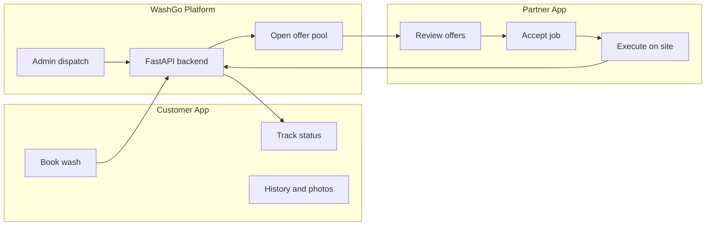
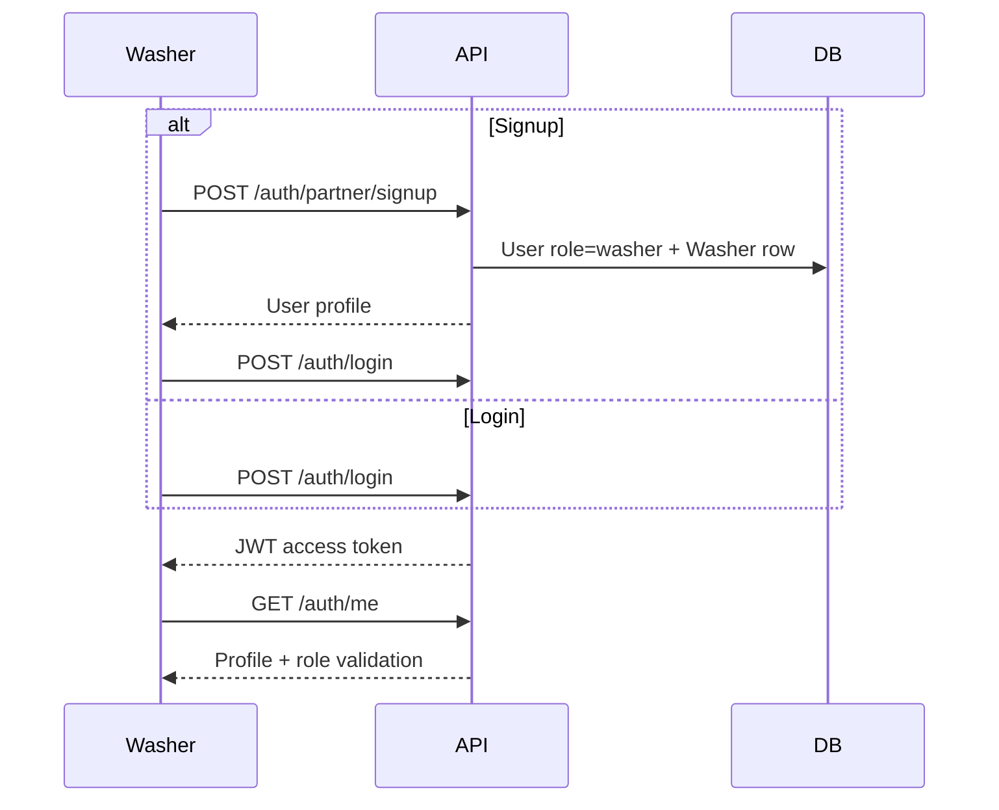
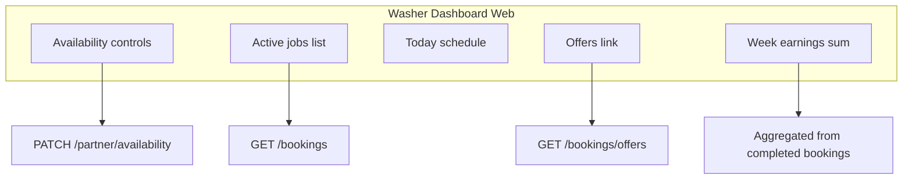
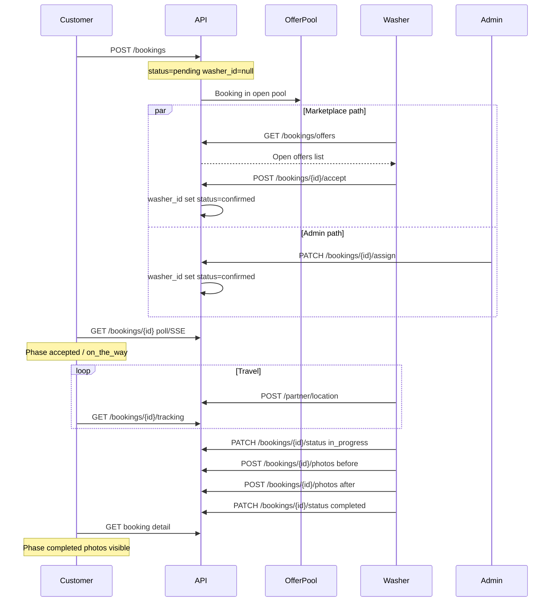
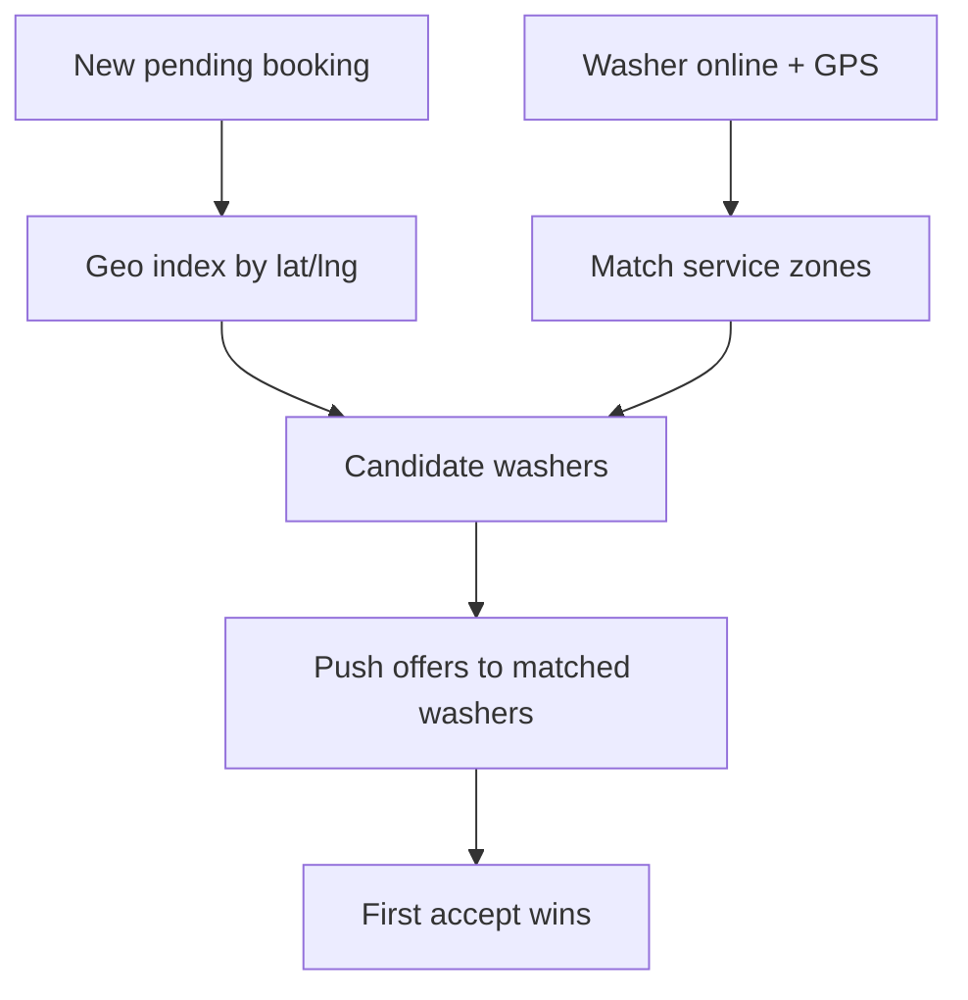
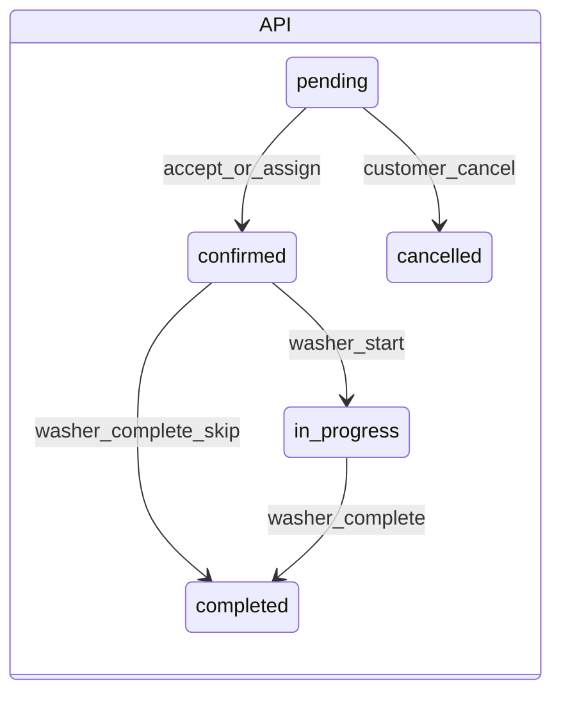
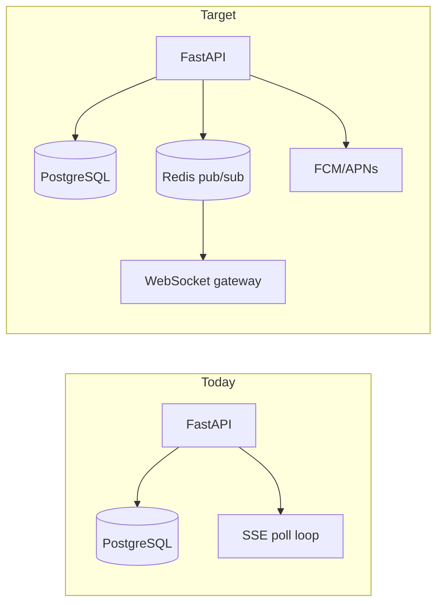

# WashGo — Washer / Partner Workflow Specification

**Version:** 1.0  
**Last updated:** May 2026  
**Audience:** Product, engineering, operations  
**Status:** Internal product & engineering documentation  

> For a non-technical overview of the partner experience, see [WashGo Application Guide](./WashGo-Application-Guide.md) (Section 4). This document is the **authoritative engineering and operations specification** for the Washer/Partner ecosystem.

---

## Document conventions

Throughout this specification, capabilities are labeled:

| Label | Meaning |
|-------|---------|
| **Implemented (today)** | Live in backend and/or web partner UI |
| **Partial / demo** | UI or model exists; not fully backed by API or production data |
| **Planned (target)** | Intended production behavior not yet shipped |

**Terminology:** In code and APIs, field operators use the role `washer`. The product UI often says **Partner**. They refer to the same user type. There is no separate `partner` role in `UserRole`.

**Primary code references:**

| Layer | Path |
|-------|------|
| Backend entry | `backend/app/main.py` |
| Booking service | `backend/app/services/booking_service.py` |
| Partner routes | `backend/app/routes/partner_routes.py` |
| Booking routes | `backend/app/routes/booking_routes.py` |
| Tracking | `backend/app/services/tracking_service.py` |
| Web partner UI | `frontend/src/pages/washer/` |
| Washer job phases (web) | `frontend/src/lib/washerJobPhase.js` |
| Customer phases (mobile/web) | `mobile/lib/customerBookingPhase.js` |
| Customer notifications (mobile) | `mobile/lib/notificationDerivation.js`, `mobile/context/NotificationContext.jsx` |

---

## Table of contents

1. [Partner / Washer App Overview](#1-partner--washer-app-overview)
2. [Washer Authentication & Onboarding](#2-washer-authentication--onboarding)
3. [Dashboard Workflow](#3-dashboard-workflow)
4. [Booking Request Lifecycle](#4-booking-request-lifecycle)
5. [Area-Based Request System](#5-area-based-request-system)
6. [Real-Time Interaction Between Customer & Washer](#6-real-time-interaction-between-customer--washer)
7. [Notification System](#7-notification-system)
8. [Washer Features](#8-washer-features)
9. [Customer ↔ Washer Interaction Logic](#9-customer--washer-interaction-logic)
10. [Booking Status & Phase System](#10-booking-status--phase-system)
11. [Production-Grade Architecture](#11-production-grade-architecture)
12. [UI/UX Expectations](#12-uiux-expectations)
- [Appendix A: API Reference (Washer)](#appendix-a-api-reference-washer)
- [Appendix B: Data Model Summary](#appendix-b-data-model-summary)
- [Appendix C: Gap Register](#appendix-c-gap-register)
- [Appendix D: Glossary](#appendix-d-glossary)

---

## 1. Partner / Washer App Overview

### 1.1 What the washer app is

The **Washer (Partner) application** is the operational surface for field staff who perform on-demand car washes at customer locations. It exists to:

- Surface **open booking requests** and allow washers to **claim** work
- Manage **assigned jobs** through travel, execution, and completion
- Report **live GPS** so customers can track arrival
- Upload **before/after photo proof**
- Control **availability** for dispatch and marketplace matching
- View **earnings** and job history (with demo augmentations on web today)

WashGo is an **async marketplace**: customers book without selecting a named washer; washers compete to accept open jobs, or operations **admin-assigns** a washer when needed.

### 1.2 Purpose in the product ecosystem



### 1.3 How it differs from the customer app

| Dimension | Customer app | Washer / Partner app |
|-----------|--------------|----------------------|
| **Role** | `UserRole.customer` | `UserRole.washer` |
| **Signup** | `POST /auth/signup` | `POST /auth/partner/signup` (+ `Washer` profile) |
| **Primary tasks** | Garage, booking wizard, tracking, cancel/reschedule (early) | Offers, accept, job workflow, GPS, photos |
| **Booking creation** | Yes | No |
| **Offer pool** | No (sees derived “searching” phase) | Yes (`GET /bookings/offers`) |
| **Status updates** | Read-only (except cancel/reschedule while pending) | `PATCH /bookings/{id}/status` |
| **Live GPS upload** | No | `POST /partner/location` |
| **Mobile (Expo)** | **Implemented** — full customer tabs | **Scaffold only** — login/signup screens; no `(partner)` routes |

### 1.4 How washers interact with customer requests

There is **no in-app chat** in v1. Interaction is **state-driven**:

1. Customer creates a booking → enters the **open offer pool**
2. Washer(s) see the offer → **accept** locks assignment
3. Both sides observe **booking status** and **customer UX phases** via polling/SSE
4. Washer uploads **GPS** → customer map/ETA updates
5. Washer advances job → API status → customer timeline updates
6. Washer uploads photos → customer views proof on booking detail

### 1.5 Platform matrix

| Surface | Status | Notes |
|---------|--------|-------|
| **Web partner** (`/partner/*` in Vite frontend) | **Implemented (today)** | Primary partner UI: dashboard, offers, schedule, job detail, earnings |
| **Backend APIs** | **Implemented (today)** | Core accept → execute → complete loop |
| **Admin console** | **Implemented (today)** | Manual assign, fleet, dispatch washers list |
| **Mobile partner** (`mobile/app/(partner)/`) | **Planned (target)** | Stubs at `partner-login.jsx`, `partner-signup.jsx`; `AuthContext` clears washer sessions |
| **Push notifications (APNs/FCM)** | **Planned (target)** | Notification ORM exists; no routes |

---

## 2. Washer Authentication & Onboarding

### 2.1 Authentication flow (Implemented today)



| Step | Endpoint | Behavior |
|------|----------|----------|
| Partner signup | `POST /auth/partner/signup` | Creates `User` with `role=washer` and linked `Washer` profile |
| Login | `POST /auth/login` | Email/password; returns JWT (24h expiry in current config) |
| Session bootstrap | `GET /auth/me` | Returns user; partner apps must reject `customer`-only sessions |
| Authorization | `Authorization: Bearer <token>` | `require_roles(UserRole.washer)` on partner/booking washer routes |

**Files:** `backend/app/routes/auth_routes.py`, `backend/app/services/user_service.py`, `frontend/src/context/PartnerAuthContext.jsx`

### 2.2 Onboarding steps

| Step | Implemented (today) | Planned (target) |
|------|---------------------|------------------|
| Account creation (name, email, password) | Yes | — |
| Phone number (optional at signup) | Stored on `User` | SMS verification |
| Service area (text) | `Washer.service_area` at signup | Geo polygon / radius editor |
| Availability default | `is_available=true` | Onboarding wizard |
| Bio / profile photo | `Washer.bio`; avatar via user | Rich profile |
| Vehicle / package capabilities | All offers visible | Per-washer capability flags |
| Email verification | Not enforced | Verification gate before going online |
| Admin approval | Not in API | `washer.status=pending_approval` workflow |
| KYC / documents | Not in API | Document upload + admin review queue |
| Training / demo job | Web demo job route | Mandatory onboarding module |

### 2.3 Profile and service area setup

**Implemented (today):**

- `Washer.service_area` — free-text label (e.g. “South Delhi”, “Gurgaon Sector 14”), max 255 characters
- Displayed on availability read, dispatch lists, and customer booking detail (washer card)
- **Not used** for offer filtering or geo-matching (see Section 5)

**Planned (target):**

- Structured service area: center lat/lng + radius km, or GeoJSON polygon
- Multiple zones per washer
- Auto-suggest from GPS at signup

### 2.4 Mobile partner auth (Partial)

- Screens: `mobile/app/(auth)/partner-login.jsx`, `partner-signup.jsx`
- On success, navigates to `/(partner)/home` — **route does not exist**
- `mobile/context/AuthContext.jsx` clears washer tokens on bootstrap (“partner app not built”)
- Welcome screen blocks partner entry with “Coming soon” alert

---

## 3. Dashboard Workflow

### 3.1 Post-login experience (Web — Implemented today)

After partner login, the web app lands on **Operations** (`WasherDashboardPage.jsx`) with:

| Zone | Data source | Washer actions |
|------|-------------|----------------|
| **Ops banner** | Local availability state | Go online/offline |
| **Availability card** | `PATCH /partner/availability` + local UX flags | Accepting / Paused, Busy, Break |
| **Trust strip** | Demo profile (`partnerFieldDemo.js`) | Read-only (Partial / demo) |
| **Today’s runs** | `GET /bookings` filtered by `scheduled_at` | Tap to open job |
| **Active jobs** | Bookings with status ∈ `pending`, `confirmed`, `in_progress` | Navigate to job detail |
| **Offers CTA** | Sync state / offers count | Link to Offers screen |
| **Earnings pulse** | Sum of `completed` bookings (7-day window) + demo chart | Link to Earnings |
| **Completed count** | `status=completed` | Informational |



### 3.2 Availability toggle (Implemented today)

**Backend:** `Washer.is_available` boolean

| Endpoint | Method | Effect |
|----------|--------|--------|
| `/partner/availability` | GET | Returns `is_available`, `service_area` |
| `/partner/availability` | PATCH | Sets `is_available` |

**Gating rules:**

- `accept_booking` requires `is_available=true` (`_get_washer_for_user`)
- Admin dispatch washer list filters available washers
- Web UI layers **local** states: Online, Accepting jobs, Busy, On break (preferences stored client-side; only `is_available` is persisted server-side today)

### 3.3 Active jobs vs pending requests

| Concept | Definition | Where shown |
|---------|------------|-------------|
| **Pending requests (offers)** | `status=pending` AND `washer_id IS NULL` | Offers page (`WasherRequestsPage.jsx`) |
| **Active jobs** | Assigned to washer; not completed/cancelled | Dashboard, Schedule, Job detail |
| **Upcoming schedule** | Assigned bookings sorted by `scheduled_at` | `WasherSchedulePage.jsx` |

### 3.4 Live status and GPS

**Implemented (today):** While on active jobs, the web job page uses `useWasherGeolocation` to call `POST /partner/location` with lat/lng/accuracy/timestamp. Stored in `washer_locations` (one row per washer). Customer tracking reads this via `GET /bookings/{id}/tracking`.

### 3.5 Notifications on dashboard

**Partial:** Web uses booking sync events and toasts. Full notification panel for washers is **Planned (target)** (Section 7). Customer mobile has a slide-in panel with derived notifications.

### 3.6 Navigation structure (Web)

| Desktop | Mobile web |
|---------|------------|
| Sidebar (`WasherSidebar.jsx`) | Bottom nav (`WasherBottomNav.jsx`) |
| Home (Operations), Offers, Schedule, Earnings | Same four tabs |
| Job detail | Full-screen job with sticky action dock |

---

## 4. Booking Request Lifecycle

### 4.1 End-to-end sequence



### 4.2 Stage-by-stage specification

#### Stage 1 — Customer creates booking

| Field | Value |
|-------|-------|
| **Trigger** | `POST /bookings` (customer auth) |
| **API status** | `pending` |
| **`washer_id`** | `null` (unless customer pre-selects washer — rare in MVP) |
| **Customer phase** | `searching` |
| **Washer UI** | Offer appears in **Offers** (if washer is online and loads offers) |
| **Side effects** | Geocode `service_address` → `latitude`/`longitude`; `price_cents` fixed at creation |

**Customer actions allowed:** cancel, reschedule (both require `status=pending`).

---

#### Stage 2 — Request visible in offer pool

| Field | Value |
|-------|-------|
| **Trigger** | Booking persisted |
| **Washer UI** | Card on Offers: address, time, vehicle label, price, ETA estimate |
| **Skip/dismiss** | **Partial:** client `sessionStorage` hide (`washgo:washer:dismissedOffers`) — not server-side |
| **Admin** | Booking appears in dispatch queue (pending, unassigned) |

---

#### Stage 3 — Washer reviews request

Washer evaluates: distance (visual/heuristic today), scheduled time, earnings (`price_cents`), vehicle/package context from notes metadata.

**No server-side reject API** — dismiss is local only.

---

#### Stage 4 — Accept or reject

| Action | Implemented | Result |
|--------|-------------|--------|
| **Accept** | `POST /bookings/{id}/accept` | `washer_id` set; `status` → `confirmed`; offer removed from pool |
| **Reject** | Not in API | Local dismiss only (Planned: `POST /bookings/{id}/decline`) |
| **Admin assign** | `PATCH /bookings/{id}/assign` | Same end state as accept without washer tap |

**Acceptance locking (Implemented today):**

- Transaction sets `washer_id` only if `status=pending` AND `washer_id IS NULL`
- Concurrent accept → second washer receives `409 Conflict` (“Booking is no longer available”)

**Requirements to accept:**

- Washer `is_available=true`
- Valid washer profile linked to user

---

#### Stage 5 — Customer notified (Planned / partial)

| Channel | Status |
|---------|--------|
| Polling/SSE refresh | **Implemented** — customer UI updates on next sync |
| Push notification “Booking accepted” | **Planned** |
| In-app notification row | **Partial** — mobile derives from booking phase locally |

**Customer phase after accept:** `accepted` (or `awaiting_acceptance` if `pending` + `washer_id` set via admin before confirm — edge case).

---

#### Stage 6 — Washer navigation / travel

| Layer | Behavior |
|-------|----------|
| **Web washer phases** | `on_the_way` stored in session (`washerJobPhase.js`); API may still be `confirmed` |
| **GPS** | `POST /partner/location` while job active |
| **Customer phase** | `on_the_way` when `confirmed` and `scheduled_at` within **−30 to +60 minutes** (`customerBookingPhase.js`) |
| **Tracking API** | `GET /bookings/{id}/tracking` — OSRM route, ETA minutes, marker positions |

**Arrival:** Web UI phase `arrived` is a **UX milestone** in session storage; API remains `confirmed` until washer marks wash started (`in_progress`).

---

#### Stage 7 — Wash starts

| Field | Value |
|-------|-------|
| **Washer action** | Advance to `wash_started` (web) → `PATCH` status `in_progress` |
| **API status** | `in_progress` |
| **Customer phase** | `in_progress` |
| **Allowed transition** | `confirmed` → `in_progress` only |

---

#### Stage 8 — Wash in progress

- Washer completes checklist (local `sessionStorage` per job)
- **Before photo** upload: `POST /bookings/{id}/photos` `kind=before`
- Customer sees “In progress” and timeline step

---

#### Stage 9 — Wash completed

| Field | Value |
|-------|-------|
| **Washer action** | **After photo** + `PATCH` status `completed` |
| **API status** | `completed` |
| **Customer phase** | `completed` |
| **Allowed transitions** | `confirmed` → `completed` (skip in_progress allowed by API) OR `in_progress` → `completed` |

---

#### Stage 10 — Payment / status update

| Area | Status |
|------|--------|
| `price_cents` on booking | **Implemented** — set at booking creation |
| `Payment` model / capture | **Planned** — ORM exists, no routes |
| Washer earnings | **Partial** — summed from completed bookings; payout rails not built |

---

#### Stage 11 — Archived to history

- Washer: job moves to completed history; offers list unaffected
- Customer: visible in bookings list under Completed filter
- Admin: remains in bookings table with terminal status

### 4.3 Cancellation and reschedule (customer-initiated)

| Action | When allowed | API |
|--------|--------------|-----|
| **Cancel** | `status=pending` only (customer) | `POST /bookings/{id}/cancel` |
| **Reschedule** | `status=pending` only | `PATCH /bookings/{id}/schedule` |

If cancelled while washer views offer: accept will fail on next attempt. Assigned washers see status `cancelled` on sync.

**Washer-initiated cancel:** **Planned** — not in API today; ops/support path for confirmed jobs.

### 4.4 Washer API status transition matrix (Implemented today)

```
confirmed  →  in_progress  |  completed
in_progress  →  completed
```

All other transitions return `422 ValidationError`.

---

## 5. Area-Based Request System

### 5.1 Current behavior (Implemented today)

**Offers are a global pool:**

```python
# booking_service.list_open_offers — simplified
WHERE status = 'pending' AND washer_id IS NULL
ORDER BY scheduled_at ASC
LIMIT 50
```

- **No filter** on booking `(latitude, longitude)` vs washer location
- **No filter** on `Washer.service_area` text
- Any online washer in the system can see all open offers (up to 50)

### 5.2 Target area-based model (Planned)



| Concept | Target behavior |
|---------|-----------------|
| **Visibility** | Washer sees offers only inside service radius or polygon |
| **Radius** | Configurable per washer (e.g. 5–25 km) |
| **Priority** | Score = f(distance, rating, acceptance rate, SLA urgency) |
| **Multi-washer** | Same offer broadcast to N eligible washers until one accepts |
| **Locking** | DB-level optimistic lock on accept (already implemented) |
| **Decline** | Server-side decline list per washer per offer TTL |

### 5.3 FAQ — operational rules

**Can one washer see all requests?**  
**Today:** Yes — all open pending unassigned bookings (limit 50).  
**Target:** No — only in-area and eligible offers.

**How should filtering work?**  
**Today:** Client-side dismiss (sessionStorage).  
**Target:** Server-side geo + capability + availability filters.

**How should request priority behave?**  
**Today:** Earliest `scheduled_at` first.  
**Target:** Composite dispatch score; optional surge zones; SLA escalation to admin.

### 5.4 Scalability considerations

- Partition offer index by geohash cell
- Read replicas for offer fanout queries
- Accept path on primary with row-level lock on `bookings.id`
- Cache washer zone definitions
- **Future:** centralized dispatch service (auto-assign) vs marketplace (accept)

---

## 6. Real-Time Interaction Between Customer & Washer

### 6.1 Sync mechanisms

| Mechanism | Endpoint | Implemented | Consumers |
|-----------|----------|-------------|-----------|
| REST sync snapshot | `GET /bookings/sync` | Yes | Web partner, web customer, mobile customer |
| SSE stream | `GET /bookings/stream?token=` | Yes | Web (EventSource JWT query param) |
| Polling interval | Config: `BOOKING_SYNC_POLL_SECONDS` | Yes | Fallback when SSE unavailable |
| WebSocket | — | Planned | Sub-second updates |
| Push (APNs/FCM) | — | Planned | Background alerts |

**Sync payload** includes a version fingerprint and counts (e.g. open offers for washers) so clients refetch lists when changed.

### 6.2 Live tracking

**Implemented today** (`tracking_service.py`):

| Input | Processing |
|-------|--------------|
| Booking coords | Geocoded/refined via Nominatim/Photon (India/Delhi bias) |
| Washer GPS | `WasherLocation` row; fresh if updated within **90 seconds** |
| Route | OSRM driving route; cached per booking |
| Fallback | Simulated washer position near customer if GPS stale or implausible (> `MAX_LOCAL_ROUTE_KM` = 45 km) |

**Customer visibility:** Map, washer marker, route polyline, ETA minutes when `shouldTrackLive(phase)` is true (`accepted`, `on_the_way`, `in_progress`).

**Washer visibility:** `WasherEtaRouteCard` on job page — same tracking endpoint.

### 6.3 ETA and arrival updates

| Event | Customer experience | Washer experience |
|-------|---------------------|-------------------|
| GPS tick | ETA/recalculated route | “On the way” phase advance |
| Approaching window | Phase may flip to `on_the_way` (time-based) | Prompt to navigate |
| Arrived (UX) | May still show `on_the_way` until API `in_progress` | Tap “Arrived” (session phase) |
| Wash started | `in_progress` | Sticky dock CTA |

### 6.4 Progress and completion updates

- Washer `PATCH` status drives customer phase for `in_progress` and `completed`
- Photos appear on customer detail after `GET /bookings/{id}/photos`
- Web celebrates completion with local animation; sync propagates to customer lists

### 6.5 Cancellation and rescheduling

| Scenario | Customer | Washer |
|----------|----------|--------|
| Cancel while pending | Offer disappears on sync | Offer removed |
| Cancel after accept | **Not self-serve** — support | Job should close (Planned: washer notification) |
| Reschedule pending | New `scheduled_at` | Offer card updates on refresh |

### 6.6 Offline handling (Planned)

- Washer: queue status updates and GPS batches; replay with idempotency keys
- Customer: show last-known washer position with stale indicator
- Conflict resolution: server timestamp wins

---

## 7. Notification System

### 7.1 Target notification catalog

| `notification_type` | Recipient | Trigger |
|----------------------|-----------|---------|
| `new_booking_request` | Washer | Booking enters offer pool in washer’s area |
| `booking_accepted` | Customer | Accept or admin assign |
| `washer_on_the_way` | Customer | Phase `on_the_way` or washer phase `on_the_way` |
| `wash_started` | Customer | `status=in_progress` |
| `wash_completed` | Customer | `status=completed` |
| `cancellation` | Both | Cancel API |
| `reschedule` | Washer | Schedule patch on pending booking |
| `payment_update` | Both | Payment captured/failed |
| `rating_review` | Washer | Customer submits review |

### 7.2 Current implementation

| Layer | Status |
|-------|--------|
| `Notification` ORM | **Implemented** — no HTTP routes |
| Server-side creation hooks | **Planned** — on accept, status change, etc. |
| Customer mobile panel | **Implemented** — derives from `deriveNotificationsFromBookings()` |
| Washer notification panel | **Planned** |
| Email/SMS | Settings exist; booking events not wired |

### 7.3 Customer mobile notification UX (Implemented today)

**Derivation:** `mobile/lib/notificationDerivation.js` — stable id `bookingId:phase`, grouped **Today** / **Earlier**.

**Context:** `NotificationContext` — `refreshFromBookings`, `dismiss`, `clearAll`, `markAsRead`, `openPanel`.

**Persistence (AsyncStorage):**

| Key | Purpose |
|-----|---------|
| `@washgo_notif_dismissed` | Dismissed notification ids |
| `@washgo_notif_last_read` | Unread cutoff timestamp |

**Panel interactions:**

- Slide-in from right (~85% width)
- Blur backdrop; tap outside to close
- Swipe-left on card to dismiss
- Tap card → `router.push(/booking/[id])` + mark read
- Clear all → dismiss all derived ids
- Unread badge on dashboard bell when `createdAt > lastReadAt`

### 7.4 Target server API (Planned)

```
GET    /notifications
PATCH  /notifications/{id}/read
POST   /notifications/read-all
DELETE /notifications/{id}
DELETE /notifications
```

Washer app should mirror customer panel patterns with role-specific types.

---

## 8. Washer Features

Feature catalog with implementation status:

| Feature | Status | Notes |
|---------|--------|-------|
| **Availability toggle** | Implemented | `/partner/availability`; gates accept |
| **Open offers / requests** | Implemented | `/bookings/offers`; local dismiss partial |
| **Accept job** | Implemented | `/bookings/{id}/accept` |
| **Active bookings list** | Implemented | `/bookings` scoped to washer |
| **Job detail workflow** | Implemented | `WasherJobPage.jsx` + sticky dock |
| **Field phase checklist** | Partial | sessionStorage per job |
| **Washer UX phases** | Partial | 8 phases in `washerJobPhase.js`; maps to 3 API statuses |
| **GPS / location reporting** | Implemented | `/partner/location` |
| **Maps / navigation** | Implemented | Tracking API + ETA card; external maps link |
| **Before/after photos** | Implemented | Upload to API; customer can view |
| **Schedule view** | Implemented | `WasherSchedulePage.jsx` |
| **Booking history** | Implemented | Completed jobs in list |
| **Earnings** | Partial | Real sums from completed; demo charts |
| **Ratings / reviews** | Planned | `rating_avg` on washer; `Review` model unused |
| **Notifications panel** | Planned | Sync toasts only today |
| **Service area management** | Partial | Text at signup; no geo editor |
| **Profile / settings** | Partial | Auth profile; limited washer settings UI |
| **Support / help** | Partial | Static / mailto |
| **Demo / training job** | Implemented | `/partner/jobs/demo` — no API calls |
| **Trust / streak badges** | Demo | `partnerFieldDemo.js` |
| **Live dispatch simulation** | Demo | `liveDispatchSimulation.js` for showcases |

### 8.1 Washer field phase model (Web — Partial)

**Order** (`washerJobPhase.js`):  
`received` → `accepted` → `on_the_way` → `arrived` → `wash_started` → `qc_review` → `awaiting_approval` → `completed`

**API mapping:**

| Washer UX phases | API `status` |
|------------------|--------------|
| `received`, `accepted`, `on_the_way`, `arrived` | `confirmed` (or `pending` for received) |
| `wash_started`, `qc_review`, `awaiting_approval` | `in_progress` |
| `completed` | `completed` |

Stored progression uses `sessionStorage` key `washgo:washer:jobPhase:{bookingId}`; effective phase = max(stored, floor from API).

---

## 9. Customer ↔ Washer Interaction Logic

### 9.1 Side-by-side visibility matrix

| Customer phase | Customer sees | Washer sees | Tracking live? | Notify (target) |
|----------------|---------------|-------------|----------------|-----------------|
| `searching` | “Finding a washer” | Offer card | No | `new_booking_request` → washer |
| `awaiting_acceptance` | “Waiting for confirmation” | Assigned (pre-confirm edge) | No | — |
| `accepted` | Scheduled; washer card | Job accepted; navigate CTA | Yes | `booking_accepted` → customer |
| `on_the_way` | Map + ETA | On the way phase | Yes | `washer_on_the_way` |
| `in_progress` | Timeline + photos incoming | Wash started; checklist | Yes | `wash_started` |
| `completed` | Photos + summary | Completed; earnings | No | `wash_completed` |
| `cancelled` | Cancelled message | Job closed / offer gone | No | `cancellation` |

### 9.2 When statuses sync

- **Source of truth:** PostgreSQL `bookings.status`, `washer_id`, timestamps
- **Clients:** poll `GET /bookings/sync` or SSE; refetch lists/detail on version change
- **Target latency:** &lt; 3s via SSE (today configurable poll); &lt; 500ms with WebSocket (planned)

### 9.3 Communication model (v1)

- **No direct messaging**
- **Status + map + photos** are the contract between parties
- **Support email** for post-accept changes (customer UI directs to support)

---

## 10. Booking Status & Phase System

### 10.1 Two layers of state

WashGo uses **API booking status** (5 values) and **customer UX phases** (7 values). Washers additionally use **field UX phases** (8 values) on web.



### 10.2 Canonical mapping table

| Customer phase | API `status` | `washer_id` | Washer pool / UI |
|----------------|--------------|-------------|-------------------|
| `searching` | `pending` | `null` | Offer |
| `awaiting_acceptance` | `pending` | set | Pre-confirmed assign (edge) |
| `accepted` | `confirmed` | set | Active job |
| `on_the_way` | `confirmed` | set | En route (time + UX) |
| `in_progress` | `in_progress` | set | Washing |
| `completed` | `completed` | set | History |
| `cancelled` | `cancelled` | any | Closed |

### 10.3 Phase derivation (customer)

**File:** `mobile/lib/customerBookingPhase.js`

```javascript
// Simplified rules
if (status === 'cancelled') return 'cancelled';
if (status === 'completed') return 'completed';
if (status === 'in_progress') return 'in_progress';
if (status === 'pending') return washerId ? 'awaiting_acceptance' : 'searching';
if (status === 'confirmed') {
  // scheduled_at within [-30, +60] minutes → on_the_way
  return 'accepted' or 'on_the_way';
}
```

### 10.4 Edge cases

| Case | Behavior |
|------|----------|
| **Race: two washers accept** | Second gets `409 Conflict` |
| **Admin assign during accept** | One succeeds first; other fails |
| **Customer cancel while washer accepts** | Depends on transaction order; losing accept shows conflict |
| **GPS stale &gt; 90s** | Tracking uses simulated position near customer |
| **Washer marks complete from `confirmed`** | API allows `confirmed` → `completed` skip |
| **Phase/time mismatch** | Customer may show `on_the_way` while API is `confirmed` |

---

## 11. Production-Grade Architecture

### 11.1 Scalability

| Area | Today | Target |
|------|-------|--------|
| Offer listing | Single query, limit 50 | Geohash-partitioned index |
| Accept | Row update with conflict check | Same + event publish |
| Tracking reads | Per-request OSRM | CDN cache + route cache TTL |
| Photos | Direct upload | Object storage + CDN |
| DB | `create_all` dev | Alembic migrations, read replicas |

### 11.2 Realtime evolution



### 11.3 Dispatch strategies

| Mode | Description | When |
|------|-------------|------|
| **Marketplace** | Open pool; washers accept | Default today |
| **Admin assign** | Ops picks washer | Backup / VIP / SLA |
| **Auto-dispatch** | Score + assign top washer | Planned |
| **Hybrid** | Broadcast + timeout → auto-assign | Planned |

### 11.4 Retry and idempotency

- **Planned:** `Idempotency-Key` header on accept and status PATCH
- Washer offline queue with exponential backoff
- GPS batch upload endpoint

### 11.5 Security and RBAC

| Rule | Implementation |
|------|----------------|
| Washer routes | `require_roles(UserRole.washer)` |
| Customer create/cancel | `require_roles(UserRole.customer)` |
| Admin assign/fleet | `require_admin_console()` |
| Booking detail | Owner customer, assigned washer, or admin |
| Photo upload | Assigned washer only |
| JWT | Bearer token; SSE uses query token |
| Admin in dev | `ADMIN_UI_DEMO_ALLOW` for demo console |

---

## 12. UI/UX Expectations

### 12.1 Design principles (washer app)

| Principle | Application |
|-----------|-------------|
| **Premium & minimal** | High contrast status chips; reduced chrome on job screen |
| **Mobile-first** | Bottom nav; sticky job dock; thumb reach |
| **Operationally efficient** | One primary CTA per job state |
| **Real-time focused** | Offers badge; sync bar; live map on job |
| **Field-safe** | Large tap targets; readable in sunlight; optional reduced motion |
| **Driving-aware** | Open external maps; minimize typing while moving |

### 12.2 Screen inventory (target mobile partner)

| Screen | Purpose |
|--------|---------|
| **Home / Operations** | Today’s jobs, availability, earnings pulse |
| **Offers** | Open requests; accept |
| **Job detail** | Map, phases, photos, complete |
| **Schedule** | Upcoming assigned jobs |
| **Earnings** | Totals, history, payout status (future) |
| **Profile** | Service area, capabilities, documents |
| **Notifications** | Panel parity with customer app |

### 12.3 Primary CTA by job state

| State | Primary CTA |
|-------|-------------|
| Offer | Accept |
| Accepted | Navigate |
| On the way | Arrived |
| Arrived | Start wash |
| In progress | Upload photos → Complete |
| Completed | Done (back to list) |

### 12.4 Theming

Align with customer design tokens: `mobile/constants/theme.js` — `phases`, `notificationTypes`, `customer.gradient*` for FAB and accents. Dark mode required for field use at night.

---

## Appendix A: API Reference (Washer)

All endpoints require `Authorization: Bearer <jwt>` unless noted.

### Auth

| Method | Path | Role |
|--------|------|------|
| POST | `/auth/partner/signup` | Public |
| POST | `/auth/login` | Public |
| GET | `/auth/me` | Authenticated |

### Partner

| Method | Path | Body | Response |
|--------|------|------|----------|
| GET | `/partner/availability` | — | `{ is_available, service_area }` |
| PATCH | `/partner/availability` | `{ is_available }` | Same |
| POST | `/partner/location` | `{ latitude, longitude, accuracy?, recorded_at? }` | `204` |

### Bookings (washer)

| Method | Path | Notes |
|--------|------|-------|
| GET | `/bookings` | Assigned bookings for washer |
| GET | `/bookings/offers` | Open pool |
| POST | `/bookings/{id}/accept` | Claim job |
| PATCH | `/bookings/{id}/status` | `{ status: confirmed\|in_progress\|completed }` |
| GET | `/bookings/{id}` | Detail + timeline + washer |
| GET | `/bookings/{id}/tracking` | Map/ETA payload |
| GET | `/bookings/{id}/photos` | List photos |
| POST | `/bookings/{id}/photos` | Multipart `kind` + `file` |
| GET | `/bookings/sync` | Sync fingerprint |
| GET | `/bookings/stream?token=` | SSE |

### Admin (related)

| Method | Path | Notes |
|--------|------|-------|
| GET | `/bookings/dispatch/washers` | Available washers |
| PATCH | `/bookings/{id}/assign` | `{ washer_id }` |

---

## Appendix B: Data Model Summary

### `Washer`

| Field | Type | Notes |
|-------|------|-------|
| `id` | UUID | PK |
| `user_id` | UUID | FK → users |
| `service_area` | string(255)? | Display / future geo |
| `is_available` | bool | Dispatch gate |
| `rating_avg` | numeric | Not updated via review API yet |
| `bio` | text? | Profile |

### `Booking`

| Field | Type | Notes |
|-------|------|-------|
| `status` | enum | pending, confirmed, in_progress, completed, cancelled |
| `washer_id` | UUID? | Set on accept/assign |
| `scheduled_at` | timestamptz | Drives on_the_way window |
| `latitude`, `longitude` | numeric | Service location |
| `price_cents` | int | Earnings basis |
| `service_address` | string | Geocoded |

### `WasherLocation`

One row per washer: live `latitude`, `longitude`, `recorded_at`.

### `BookingPhoto`

`kind`: `before` | `after`; stored per booking.

### `Notification` (unused routes)

`user_id`, `title`, `body`, `read`, `notification_type`, `data` (JSONB).

### `Payment` (unused routes)

`booking_id`, `amount_cents`, `status`, `provider`, `external_id`.

---

## Appendix C: Gap Register

| Gap | Impact | Priority |
|-----|--------|----------|
| No geo-based offer filtering | All washers see all offers | High |
| No `reject/decline` API | Skips are client-only | Medium |
| No notification routes | No server-driven alerts | High |
| No payment capture | Earnings not tied to payouts | High |
| No review API | Ratings static | Medium |
| No washer cancel API | Ops burden | Medium |
| Mobile partner app missing | Washers web-only | High |
| Washer session cleared on mobile | Cannot dogfood partner mobile | High |
| KYC / approval workflow | Trust & safety | Medium |
| Alembic migrations | Production deploy risk | High |
| WebSocket layer | Latency | Medium |
| Auto-dispatch service | Ops scale | Low (post-MVP) |

---

## Appendix D: Glossary

| Term | Definition |
|------|------------|
| **Partner** | Product name for a field washer; role in API is `washer` |
| **Washer** | Database entity linked 1:1 to a `User` with role `washer` |
| **Customer** | End user who books washes |
| **Admin** | Operations user; dispatch and fleet |
| **Offer** | A booking in the open pool (`pending`, no `washer_id`) |
| **Accept** | Washer claims offer; sets `washer_id`, `status=confirmed` |
| **Assign** | Admin sets `washer_id` (and confirms if pending) |
| **Phase** | UX-level status (7 customer phases; 8 washer field phases) |
| **API status** | Canonical `BookingStatus` enum (5 values) |
| **Sync** | Versioned fingerprint to trigger client refetch |
| **Tracking** | Map, route, ETA for a booking |

---

*End of Washer Partner Workflow Specification*
