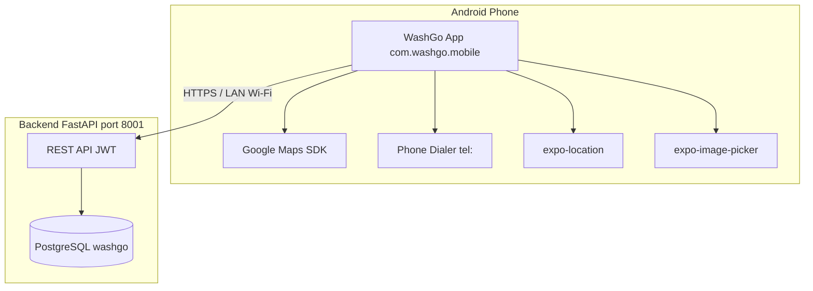
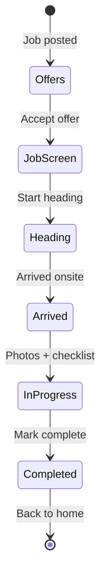

# WashGo Mobile — Android Project Guide

> **Audience:** Developers and testers installing WashGo on **physical Android phones**  
> **App package:** `com.washgo.mobile`  
> **Version:** 1.0.0 (Expo SDK 55)  
> **Last updated:** May 2026

---

## Table of contents

1. [Project purpose](#1-project-purpose)
2. [High-level overview](#2-high-level-overview)
3. [How the app works](#3-how-the-app-works)
4. [Customer portal features](#4-customer-portal-features)
5. [Partner (washer) portal features](#5-partner-washer-portal-features)
6. [Technology stack](#6-technology-stack)
7. [Android-specific setup](#7-android-specific-setup)
8. [Build & install on a real Android phone](#8-build--install-on-a-real-android-phone)
9. [Environment configuration](#9-environment-configuration)
10. [Project structure](#10-project-structure)
11. [Backend API integration](#11-backend-api-integration)
12. [Demo accounts](#12-demo-accounts)
13. [Android limitations & testing notes](#13-android-limitations--testing-notes)
14. [Related documentation](#14-related-documentation)

---

## 1. Project purpose

**WashGo** is an on-demand car wash platform. The mobile app connects:

- **Customers** — book a wash at their location, track the washer, pay, and manage vehicles.
- **Partners (washers)** — receive job offers, navigate to customers, document the wash with photos, and earn payouts.

The mobile app is built with **React Native (Expo)** and talks to a **FastAPI** backend (`Wash-Go/backend`). This document focuses on the **Android** experience: native dev builds, Google Maps, location, phone dialer, and production-style testing on real devices.

> **Important:** WashGo on Android is **not** a full replacement for Expo Go. Maps, custom native keys, and reliable calling require a **development build** (`npm run android`) or a built **APK**.

---

## 2. High-level overview

### Two portals in one app

| Portal | Who uses it | Main tabs / areas |
|--------|-------------|-------------------|
| **Customer** | Car owners | Home, Bookings, Garage, Rewards, Profile |
| **Partner** | Washers / service providers | Home, Offers, Schedule, Wallet (Earnings), Profile |

Users sign in separately (customer vs partner). The app remembers the **last active role** and routes accordingly after splash.

### System diagram



### What makes Android different from Expo Go

| Capability | Expo Go | Android dev build / APK |
|------------|---------|-------------------------|
| Google Maps tiles | Limited / blank | Works with `GOOGLE_MAPS_API_KEY` |
| `tel:` customer calls | Unreliable | Native dialer on real device |
| Custom `app.config.js` keys | Not applied | Baked into native binary |
| Partner location reporting | Partial | Full while on active job |

---

## 3. How the app works

### 3.1 Authentication flow

1. User opens app → splash screen (`WaterRingRevealSplash`).
2. App checks stored JWT for customer and/or partner (`expo-secure-store`).
3. Routes to:
   - Customer dashboard if customer session exists (or last role = customer).
   - Partner home if partner session exists.
   - Welcome screen if neither.

**Sign-up / login** supports email + password + **OTP** (demo accounts skip OTP). Partner and customer have separate auth screens.

### 3.2 Customer booking flow (new wash)

Five-step flow under `/new-wash/`:

| Step | Screen | What happens |
|------|--------|----------------|
| 1 | Vehicle | Pick car from garage |
| 2 | Package | Choose wash tier + vehicle size → price estimate |
| 3 | Schedule | Address search, **map pin**, date/time, **special instructions** |
| 4 | Review | Confirm details and price |
| 5 | Payment | Demo payment → `POST /bookings` |

After success, customer sees active booking on **Dashboard** and can open **Booking detail** for live tracking.

**Address & maps on Android:**

- `AddressSearchField` geocodes via backend `GET /geocode`.
- `MapPicker` uses `react-native-maps` with **Google provider** on Android.
- Customer must use a **dev build**; map tiles need `GOOGLE_MAPS_API_KEY` in `mobile/.env`.

### 3.3 Partner job lifecycle



All job work happens on **one screen**: `/(partner)/job/[id]`

- Live route map (`RouteMapCard`)
- Customer info + **Call** button (`tel:` via `openPhoneCall`)
- Field briefing (package, vehicle, customer instructions)
- Photo proof (before / after / arrival)
- Wash checklist
- Sticky footer CTA advances phases → syncs `PATCH /bookings/{id}/status`

See also: [partner-job-flow.md](./partner-job-flow.md)

### 3.4 Real-time & sync

- Bookings sync via polling (`/bookings/sync` fingerprint) on customer and partner layouts.
- Live washer location on job map: `GET /bookings/{id}/tracking` + partner `POST /partner/location` while job is active.
- Notifications banner for booking updates.

---

## 4. Customer portal features

### Home (Dashboard)

- Active booking hero with phase pill (e.g. En route, In progress).
- Quick **Book a wash** entry (resumes draft if present).
- Recommendations and rewards points preview.
- Notifications panel.

### Bookings

- List of past and upcoming washes.
- Tap booking → detail with map, timeline, washer info, cancel/reschedule where allowed.

### Garage

- Add / edit vehicles (make, model, plate, color).
- Vehicle art on booking cards.

### Rewards

- Points display (mock / preview data integrated with UI).

### Profile

- Personal info, appearance (light/dark — **scoped per account + portal**).
- Support links, sign out.

### Booking detail (`/booking/[id]`)

- Phase timeline.
- Map with washer + customer markers and route polyline when tracking is available.
- Actions: cancel, approve arrival, review after completion.

---

## 5. Partner (washer) portal features

### Home

- **Availability card** — Online / offline / busy (account-wide, `PATCH /partner/availability`).
- **Live zone card** — Map preview of service area + nearby offer count.
- **Stats grid** — Today’s bookings, active jobs, completed, earnings.
- **Active job card** — Jump into current job.
- **Job timeline** — Today’s jobs at a glance.

### Offers

- Open jobs in the washer’s zone.
- **Accept** → navigates to job screen (`POST /bookings/{id}/accept`).

### Schedule

- Month/day picker with job counts per day.
- **Timeline** per day — expand job, **Navigate** (turn-by-turn), **View summary**.
- **Optimized route card** — real **Google Map** with stop pins + polyline (not Expo Go).
- Earnings preview for selected day.

### Wallet (Earnings)

- Hero earnings card, weekly chart, pending payout, payout history.
- Stats mini cards.

### Profile

- Partner profile, service area, theme, sign out.

### Job workspace (`/job/[id]`)

| Section | Purpose |
|---------|---------|
| Route map | Washer + customer pins, ETA chip, polyline |
| Customer card | Name, address, vehicle, payout, maps / message |
| Field briefing | Package + vehicle chips, customer instructions, arrival notes |
| Photo proof | Before / after tabs with upload progress |
| Checklist | Required steps before completing |
| Timeline | Service milestones |
| Footer CTA | Phase-advancing primary button + **Call** |

**Call customer (Android):**

- Uses `mobile/lib/partnerPhone.js` → `openPhoneCall()` → `tel:` URI.
- Works on **physical phones** only; simulators show a clear message.

**Navigate (Schedule / job):**

- Uses `mobile/lib/openExternalMaps.js` → `google.navigation:` on Android.

---

## 6. Technology stack

### Core framework

| Technology | Version (approx.) | Purpose |
|----------|-------------------|---------|
| **Expo** | ~55 | Build tooling, native modules, dev client |
| **React Native** | 0.83 | Cross-platform UI |
| **React** | 19.2 | UI components |
| **expo-router** | ~55 | File-based navigation |

### UI & UX

| Library | Purpose |
|---------|---------|
| **moti** | Lightweight animations |
| **react-native-reanimated** | Gestures, scroll-linked UI |
| **expo-linear-gradient** | Premium cards, heroes |
| **expo-blur** | Glass footers (iOS-style; fallback on Android) |
| **lucide-react-native** | Icons |
| **react-native-svg** | Charts, route decorations |

### Maps & location

| Library | Purpose |
|---------|---------|
| **react-native-maps** | Maps (Google provider on Android) |
| **expo-location** | GPS for map picker, partner location reporter |
| **expo-linking** | Open maps app, phone dialer |

### Media & storage

| Library | Purpose |
|---------|---------|
| **expo-image-picker** | Proof photos |
| **expo-image** | Optimized image display |
| **expo-secure-store** | JWT tokens |
| **@react-native-async-storage/async-storage** | Drafts, preferences, job phase cache |

### App-specific modules

| Path | Purpose |
|------|---------|
| `lib/apiConfig.js` | API base URL (LAN IP for real Android device) |
| `lib/cardSurfaceStyle.js` | Android-safe card borders (no elevation gaps) |
| `lib/selectableCardStyle.js` | Selection cards on Android |
| `lib/openExternalMaps.js` | Navigate / geocode fallback |
| `lib/partnerPhone.js` | Dial customer |
| `lib/parseBookingBriefing.js` | Structured job briefing from booking notes |
| `services/bookingService.js` | Booking CRUD, meta encoding in `notes` |
| `context/ThemeContext.jsx` | Light/dark per portal + account |

---

## 7. Android-specific setup

### Prerequisites (one-time)

1. **Node.js** (LTS)
2. **Android Studio** — SDK Platform, Build-Tools, Platform-Tools
3. **JDK 17** (bundled with Android Studio)
4. Environment variables (macOS example):

```bash
export ANDROID_HOME=$HOME/Library/Android/sdk
export PATH=$PATH:$ANDROID_HOME/platform-tools
```

### Android permissions (declared in app)

From `app.json` / manifest merge:

- `ACCESS_FINE_LOCATION` / `ACCESS_COARSE_LOCATION` — map picker, live tracking
- Internet — API calls
- Camera / storage — via `expo-image-picker` plugin at build time

### Google Maps on Android

1. Create key in [Google Cloud Console](https://console.cloud.google.com).
2. Enable **Maps SDK for Android**.
3. Restrict key to package `com.washgo.mobile` + **debug SHA-1**:

```bash
cd mobile/android
./gradlew signingReport
```

4. Add to `mobile/.env`:

```env
GOOGLE_MAPS_API_KEY=your_key
EXPO_PUBLIC_GOOGLE_MAPS_API_KEY=your_key
```

5. **Rebuild** after any key change (`npm run android`).

### API URL on a real phone

Emulator uses `http://10.0.2.2:8001`. A **real phone** cannot reach your Mac’s `127.0.0.1`.

Set in `mobile/.env`:

```env
EXPO_PUBLIC_API_URL=http://YOUR_MAC_LAN_IP:8001
```

Phone and Mac must be on the **same Wi‑Fi**. Backend must listen on `0.0.0.0` or your LAN IP.

---

## 8. Build & install on a real Android phone

### Method A — USB install (recommended for development)

1. Enable **Developer options** → **USB debugging** on the phone.
2. Connect USB → accept debugging prompt.
3. Verify: `adb devices`
4. Start backend on port **8001**.
5. Configure `mobile/.env` (API URL + Maps key).
6. Run:

```bash
cd mobile
npm install
npm run android
```

First build takes 10–20+ minutes. App installs as **WashGo** (`com.washgo.mobile`).

### Method B — Debug APK file

After at least one successful `npm run android`:

```bash
cd mobile/android
./gradlew assembleDebug
```

APK path:

```text
mobile/android/app/build/outputs/apk/debug/app-debug.apk
```

Install:

```bash
adb install -r mobile/android/app/build/outputs/apk/debug/app-debug.apk
```

Or copy the APK to the phone and install manually (allow unknown sources).

### Useful npm scripts

| Command | Description |
|---------|-------------|
| `npm run android` | Build + install dev client on device/emulator |
| `npm start` | Metro bundler only (app already installed) |
| `npm run start:device` | Metro tuned for physical device |
| `npm run kill-metro` | Free port 8081 |

---

## 9. Environment configuration

Copy `mobile/.env.example` → `mobile/.env`.

| Variable | Required on Android | Purpose |
|----------|---------------------|---------|
| `EXPO_PUBLIC_API_URL` | **Yes** (real device) | Backend base URL (LAN IP) |
| `GOOGLE_MAPS_API_KEY` | **Yes** (maps) | Native Android Maps |
| `EXPO_PUBLIC_GOOGLE_MAPS_API_KEY` | Optional alt | JS-side key detection |

Config is merged in `app.config.js` into native `android.config.googleMaps.apiKey`.

---

## 10. Project structure

```text
mobile/
├── app/                          # expo-router screens
│   ├── (auth)/                   # Login, signup, OTP, welcome
│   ├── (customer)/               # Customer tabs
│   ├── (partner)/                # Partner tabs + job/[id]
│   ├── new-wash/                 # Booking funnel
│   ├── booking/                  # Customer booking detail
│   ├── add-vehicle/              # Add car flow
│   └── index.jsx                 # Splash + role routing
├── components/
│   ├── customer/                 # Customer UI
│   ├── partner/                  # Partner UI + job components
│   └── ui/                       # Shared (CardSurface, SelectableCard)
├── context/                      # Auth, theme, booking, earnings
├── hooks/                          # Sync, location reporter, padding
├── lib/                          # Helpers (maps, phone, briefing, theme)
├── services/                     # API clients
├── constants/                    # Themes (customer, partner, job, schedule)
├── docs/                         # Documentation (this file)
├── app.config.js                 # Expo native config (Maps keys)
├── app.json                      # Expo manifest
└── package.json
```

---

## 11. Backend API integration

Default port: **8001** (`mobile/lib/apiConfig.js`).

### Customer-relevant endpoints

| Endpoint | Use |
|----------|-----|
| `POST /auth/login`, `/auth/signup` | Authentication |
| `GET /bookings` | List bookings |
| `POST /bookings` | Create wash |
| `GET /bookings/{id}` | Booking detail |
| `GET /bookings/{id}/tracking` | Live map |
| `GET /geocode` | Address → coordinates |
| `POST /bookings/{id}/cancel` | Cancel |

### Partner-relevant endpoints

| Endpoint | Use |
|----------|-----|
| `GET /bookings/offers` | Offer feed |
| `POST /bookings/{id}/accept` | Accept job |
| `GET /bookings/{id}` | Job detail |
| `PATCH /bookings/{id}/status` | Status updates |
| `PATCH /bookings/{id}/milestone` | Service phase |
| `POST /bookings/{id}/photos` | Proof uploads |
| `GET /partner/availability` | Online status |
| `PATCH /partner/availability` | Toggle availability |
| `POST /partner/location` | Live washer GPS |
| `GET /partner/earnings` | Wallet data |

Full backend setup: `Wash-Go/backend/README.md`

---

## 12. Demo accounts

When backend runs with `ENVIRONMENT=development`:

| Role | Email | Password |
|------|-------|----------|
| Customer | `customer@washgo.demo` | `Demo1234` |
| Partner | `partner@washgo.demo` | `Demo1234` |

Demo accounts **skip OTP** for faster testing.

---

## 13. Android limitations & testing notes

| Topic | Simulator / emulator | Real Android phone |
|-------|----------------------|---------------------|
| Phone calls | Not supported (friendly message) | Opens dialer via `tel:` |
| Google Maps | May work with Play image + key | Full experience |
| API backend | Use `10.0.2.2:8001` | Use Mac/PC LAN IP in `.env` |
| GPS | Simulated location | Real GPS |
| Photo upload | Works | Works (camera/gallery) |

### UI polish on Android

The app includes Android-specific fixes for:

- Card elevation gaps → `CardSurface`, `getCustomerShadow` / `getPartnerShadow` (`elevation: 0` + hairline border)
- Selection cards → `SelectableCard` + solid fills
- Photo proof tab badges → readable count on selected tab

---

## 14. Related documentation

| Document | Description |
|----------|-------------|
| [partner-job-flow.md](./partner-job-flow.md) | Partner job screen phases and API mapping |
| [../.env.example](../.env.example) | Environment variable template |
| [../../backend/README.md](../../backend/README.md) | Backend setup and API |

---

## Quick start checklist (Android phone)

- [ ] Android Studio + SDK installed  
- [ ] `adb devices` shows your phone  
- [ ] Backend running on port 8001  
- [ ] `mobile/.env` with `EXPO_PUBLIC_API_URL` and `GOOGLE_MAPS_API_KEY`  
- [ ] `cd mobile && npm install && npm run android`  
- [ ] Sign in as customer or partner demo account  
- [ ] Test book a wash (maps + instructions) or accept a job as partner  

---

*WashGo — Mobile app documentation for Android. For iOS builds, use `npm run ios` with the same `.env` patterns (use LAN IP for device testing).*
